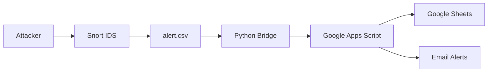

<!-- =============================== -->
<!-- 🛡️ SNORTSHEET – OFFICIAL README -->
<!-- =============================== -->

<p align="center">
  
</p>

<h1 align="center">🛡️ SnortSheet</h1>
<h3 align="center">The <span style="color:#00e676">Serverless SIEM</span> & <span style="color:#7c4dff">Agentic SOC Framework</span></h3>

<p align="center">
  Turn <b>Google Sheets</b> into a <b>Real-Time Security Dashboard</b><br>
  Open-source Python middleware bridging <b>Snort IDS</b> with <b>Agentic AI</b> (n8n, LLMs)
</p>

<p align="center">
  
  
  
  
</p>

---

## 📖 Table of Contents

- About the Project  
- Why SnortSheet  
- The Agentic SOC Vision  
- Technical Architecture  
- Security Considerations  
- Installation Guide  
- Usage & Testing  
- Advanced Configuration  
- Troubleshooting & FAQ  
- Developer  
- License  

---

## 🧐 About the Project

**SnortSheet** is a lightweight, open-source middleware that acts as a **bridge between Snort IDS and the cloud**.

It connects the industry‑standard deep packet inspection capabilities of **Snort** with the accessibility and collaboration power of **Google Sheets**, turning raw intrusion alerts into a **live SOC dashboard**.

### ❌ The Traditional Problem
Managing Snort logs typically requires:
- MySQL or PostgreSQL
- ELK Stack (Elasticsearch, Logstash, Kibana)
- Proprietary SIEMs like Splunk

These solutions are expensive, resource-heavy, and difficult to maintain—especially for:
- Students
- Home labs
- Researchers
- Small teams

### ✅ The SnortSheet Approach
SnortSheet removes the database entirely and **streams alerts directly to the cloud**, providing:
- Real-time visibility
- Zero infrastructure cost
- No maintenance overhead

---

## 💎 Why SnortSheet?

<table>
<tr>
<td width="33%" align="center">
⚡<br><b>Serverless by Design</b><br>
Google Sheets acts as database + dashboard with 99.9% uptime
</td>
<td width="33%" align="center">
📱<br><b>Instant Accessibility</b><br>
Monitor alerts from anywhere using Google Sheets mobile app
</td>
<td width="33%" align="center">
🧠<br><b>Noise-Aware Intelligence</b><br>
Built‑in deduplication and alert throttling
</td>
</tr>
</table>

### 🔥 Intelligent Anti‑Flood Logic

SnortSheet includes a smart algorithm that:
- Groups alerts using **(Source IP + Signature)**
- Applies a configurable **cooldown timer**
- Prevents API throttling and notification spam
- Preserves *every alert* for forensic analysis

---

## 🚀 The Agentic SOC Vision

SnortSheet is designed as the **trigger layer** for an **agentic Security Operations Center**.

Once alerts land in Google Sheets, they become immediately consumable by:
- **n8n workflows**
- **LLMs (OpenAI, Gemini, etc.)**
- **Custom security agents**

### Example Agentic Workflows

| Scenario | Agentic Action |
|--------|----------------|
| False Positives | LLM analyzes Snort rule context |
| Brute Force Attack | Automation blocks attacker IP |
| Unknown IP | Threat intel enrichment |
| Incident Review | AI-generated SOC summary |

> Data engineering is the hardest part of AI security automation — SnortSheet solves it.

---

## ⚙️ Technical Architecture



### Component Roles

| Component | Purpose |
|--------|--------|
| Snort IDS | Packet inspection |
| Python Bridge | Throttling, deduplication |
| Apps Script | Secure cloud receiver |
| Google Sheets | SOC dashboard |
| Email | Real-time notification |

---

## 🔒 Security Considerations

✔️ One‑way outbound traffic only  
✔️ HTTPS (TLS 1.2 / 1.3)  
✔️ No Google credentials stored  
✔️ Hidden backend logic  
✔️ Strict input validation  

> The sensor pushes data — nothing pulls from your network.

---

## 🛠️ Installation Guide

### Prerequisites
- Ubuntu / Debian / Kali Linux
- Python 3.8+
- Active internet connection

### Phase 1 — Google Backend
1. Create a Google Sheet  
2. Extensions → Apps Script  
3. Paste `code.gs`  
4. Deploy as Web App (Access: Anyone)  
5. Copy Webhook URL  

### Phase 2 — Snort Sensor
```bash
sudo apt update && sudo apt install snort -y
```

Add to `/etc/snort/snort.conf`:
```conf
output alert_csv: /var/log/snort/alert.csv timestamp,msg,proto,src,srcport,dst,dstport
```

Validate:
```bash
sudo snort -T -c /etc/snort/snort.conf
```

### Phase 3 — Python Bridge
```bash
pip3 install -r requirements.txt
sudo python3 snort_bridge.py
```

---

## 🏃‍♂️ Usage & Testing

| Test | Command | Expected |
|----|--------|---------|
| ICMP | `ping <sensor-ip>` | Email + Sheet |
| DNS | `nslookup google.com` | DNS alert |
| HTTP | `curl http://example.com` | Web alert |

---

## 🔧 Advanced Configuration

| Variable | Description |
|-------|-------------|
| EMAIL_COOLDOWN | Alert debounce window |
| LOG_FILE | Custom Snort log path |
| SLEEP_TIME | API rate control |

---

## ❓ Troubleshooting & FAQ

**No alerts appearing?**
- Check `tail -f /var/log/snort/alert.csv`
- Verify Snort rules are firing
- Confirm network interface

**Emails not arriving?**
- Check spam folder
- Redeploy Apps Script as new version
- Confirm access set to “Anyone”

---

## 👨‍💻 Developer

**Sahil Thakur**  
Lead Developer & Security Researcher  

> “Security is not a product, but a process.” — Bruce Schneier

---

## 📄 License

MIT License

Copyright (c) 2026 Sahil Thakur

Permission is hereby granted, free of charge, to any person obtaining a copy
of this software and associated documentation files (the "Software"), to deal
in the Software without restriction, including without limitation the rights
to use, copy, modify, merge, publish, distribute, sublicense, and/or sell
copies of the Software, and to permit persons to whom the Software is
furnished to do so, subject to the following conditions:

The above copyright notice and this permission notice shall be included in all
copies or substantial portions of the Software.

THE SOFTWARE IS PROVIDED "AS IS", WITHOUT WARRANTY OF ANY KIND.
